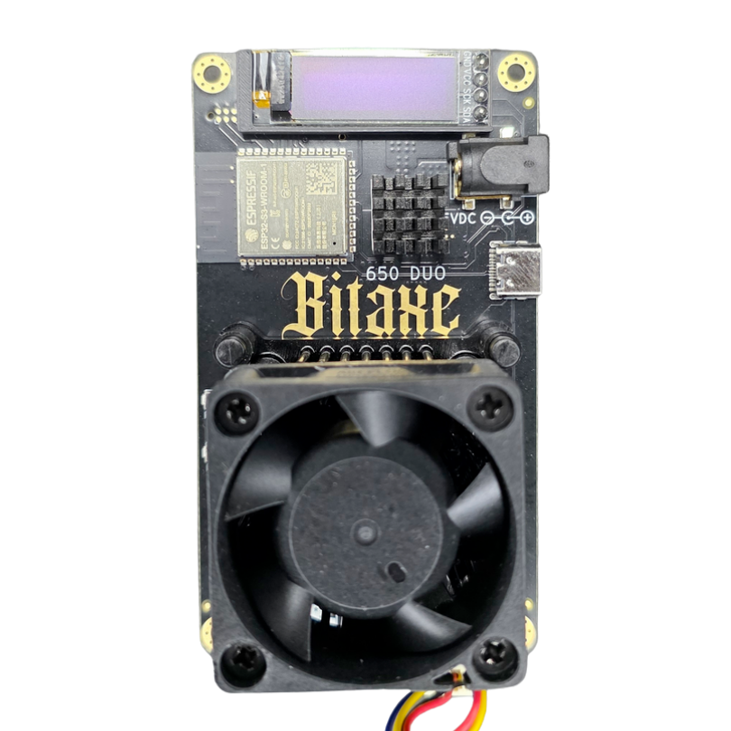

## What is this?

Gamma Duo is a revision of the Bitaxe Gamma that reuses low-performing chips from the S21 lineup. Instead of discarding underperforming chips, this board puts them to work. With this board we make use of every available chip.

## 🛠️ Hardware

- The BM1370 is an undocumented SHA256 mining ASIC from Bitmain, used in the Antminer S21 lineup
- Bitmain claims the BM1370 has 15 J/TH efficiency
- The BM1370 has a similar footprint and pinout to the BM1368 used in previous Bitaxe models

## Software

1. Building your Software

   - You can build your own binary files from the source code. For more details follow this [Build-Guide](/axeos/compile).

2. Using a prebuild

   - Every Bitaxe is controlled by the open source [ESP-Miner](https://github.com/bitaxeorg/ESP-Miner) software. It features a WebUI for user-friendly usage and controllability.
   - In this repository you will also find a [releases](https://github.com/bitaxeorg/ESP-Miner/releases) page that will contain prebuild binary files to flash to your Bitaxe using the [Bitaxetool](https://github.com/johnny9/bitaxetool) created by [johnny9](https://github.com/johnny9)

3. Flashing Process
   - The [ESP-Miner](https://github.com/bitaxeorg/ESP-Miner) Software can be flashed via a USB cable onto the Bitaxe. Therefore you need to follow the initial Guide in the repository.

:::caution[This page is not written yet.]
Help us to complete the wiki by using the "Edit page" button at the end of the page 👇
:::
