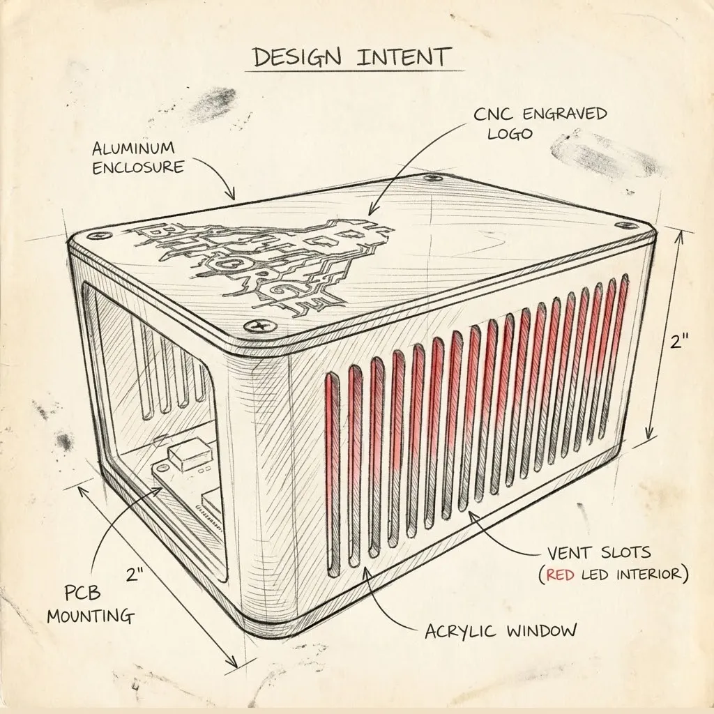

The BitForge Nano is an open-source, dual-chip Bitcoin ASIC miner designed for solo and home mining. It was developed by WantClue in collaboration with the manufacturer DTV Electronics. The board is designed in Germany by WantClue Technologies and produced by DTV Electronics, while the case, custom heatsink, and airflow CFD analysis were contributed by "I Am GPIO" of The Solo Mining Co.

The device is built around two Bitmain BM1370 ASIC chips, making it one of the first dual-chip ASIC miners aimed at the home segment. Mining operations, cooling, and connectivity are managed by an ESP32-S3-WROOM-1 microcontroller, and the unit connects over Wi-Fi only, with no Ethernet port. It runs ForgeOS, an open-source firmware that exposes a browser-based dashboard for pool configuration, monitoring, and performance tuning.

The Nano provides three performance profiles, ranging from roughly 2.0 TH/s in eco mode to about 2.6 TH/s in performance mode, while drawing approximately 40 W — an efficiency of around 15 J/TH. Cooling is handled by two 40×20 mm 12 V PWM fans feeding a custom heatsink, with measured noise levels around 30 dB.

