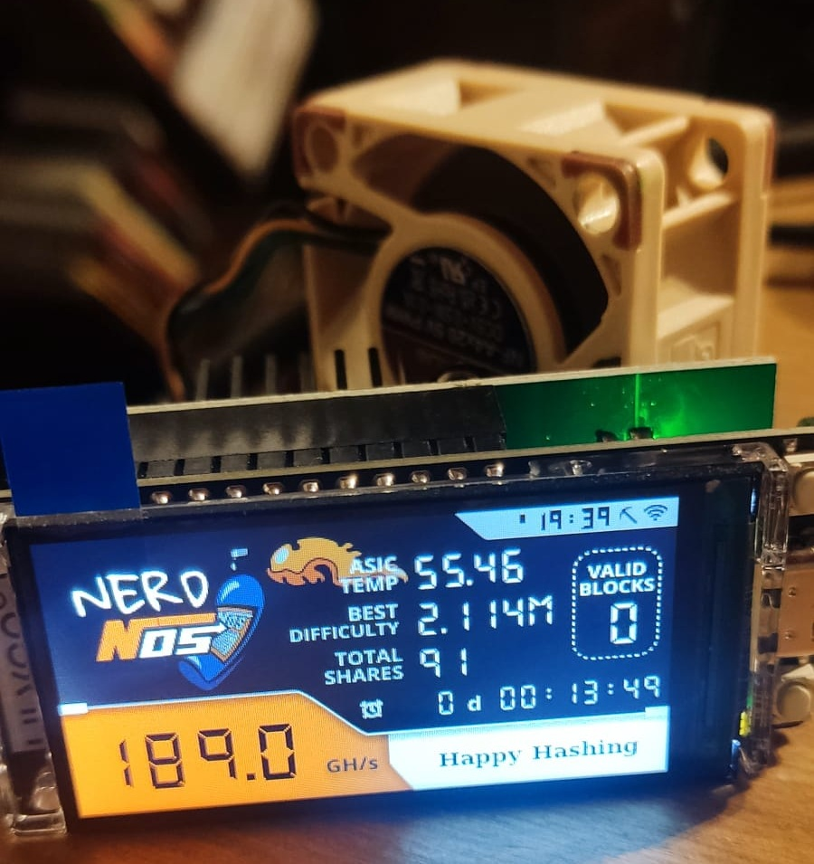

The NerdNOS is an attachment board for the Nerdminer and boosts it's hashrate up to 150~200 GH/s.
It utilized the BM1397 (known of the Bitaxe Max) to achieve this. 

In order to stay performant and don't cosume too much power it's heavily underclocked in order to get a power draw of about 8W.

- NerdNOS Screen > Mining data of Nerdminer
- ClockMiner Screen > Fashion style clock miner
- GlobalStats Screen > Global minery stats and relevant data

### Software

The Software can be installed via the bitaxe web flasher available [here](https://flasher.bitaxe.org).

## Setup Instructions

1. **Connect the Device**: Connect the NerdNOS to a USB port (min. 2A). Wait a short time before the WiFi message appears on the display. Scan the QR code or open the WiFi settings on your smartphone/PC and select **"NerdMinerAP"**. Use the password `MineYourCoins` to establish the connection.

2. **Configure WiFi**: Once connected, the "WiFiManager" page should open automatically. Select the **"Configure WiFi"** button.

3. **Connectivity and Address**:
   - Select your Wi-Fi network and enter the password.
   - In the **"Your BTC address"** field, enter your on-chain Bitcoin address. 
   -  #### Delete the placeholder text `yourBtcAddress` before pasting your actual address
   - In the **"TimeZone fromUTC"** field, enter `2` for Central European Summer Time or `1` for Central European Winter Time.
   - Click **"Save"** to apply the settings.

4. **Monitor Connection**: You can check your miner's connection by entering your BTC address on the pool you're connected to.

## Key Assignment

| Button | Action |
| :--- | :--- |
| **Button 1** | Short press: switch to the next display |
| | Hold while plugging in power: change existing entries |
| | Hold for 5 seconds: reset all saved entries |
| **Button 2** | Short press: turn display on/off (mining continues) |