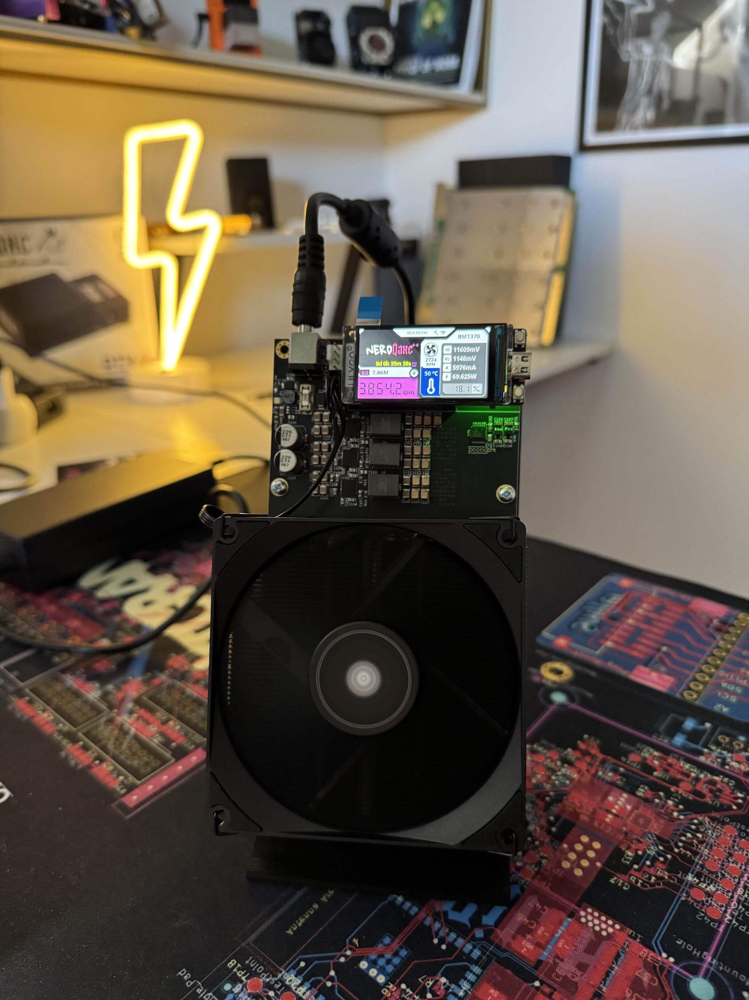

This is a **free and open source project** that lets you try to reach a bitcoin block with a small piece of hardware.
The main goal of this project is to let you **learn more about minery** and to have a beautiful piece of hardware on your desktop.

It originates from the [BitaxeUltra](https://github.com/skot/bitaxe) and builds upon the concept of combining a user-friendly display with high-performance ASIC mining chips.

NerdQAxe++ uses four BM1370 ASIC chips from the Antminer S21 series. It delivers a hashrate of up to 4.8 TH/s while consuming approximately 60 watts of power, making it one of the most energy-efficient home miners available. Its compact design is optimized for silent operation and minimal heat output, making it ideal for home use.

The project specifically uses the Lilygo T-Display S3 and a modified QAxe++ board. It communicates with the ASIC chips via GPIO pins and displays all mining statistics and system information on the integrated screen.

It comes with a modified version of AxeOS found [here](https://github.com/shufps/ESP-Miner-NerdQAxePlus).

